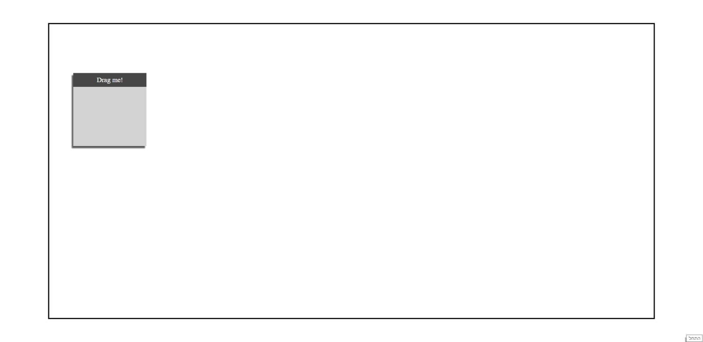
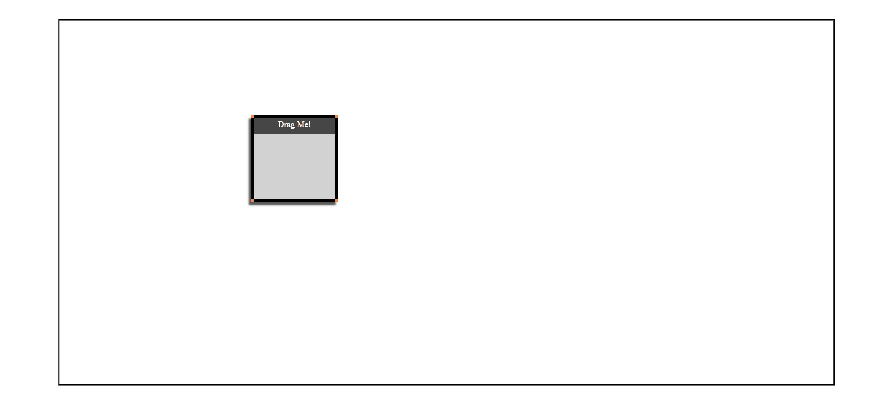

# Drag & Scale Challenge
Show your dominance in front end vanilla JavaScript by creating a movable scaleable object!

## Instructions
Clone [this](https://github.com/suvelocity/DragAndScaleBoilerplate) repository to your computer, which contains the following:

* ``index.html`` - a ready div with the id ``playground`` for you and a div with the id of ``main`` which includes another div inside with the id ``header``.

* ``stlye.css`` - ready css that styles our playground.

* ``index.js`` - Where the fun happens!!!

The playground as you get it:

Your mission, if you choose to accept it, is to make the div ``main`` moveabble and resizeable by dragging it's edges with mouse.

Example:

Write your solution in the file ``index.js``. You are allowed to add code also to ``index.html`` and ``style.css``, **but it is important you do not change any of our code, only add yours below (or tests might fail).**

## Requirements
* I am able to drag the div ``main`` when clicking the div ``header`` and moving the mouse around.

* I am able to resize the div ``main`` horrizonally or vertically by dragging it's edges (the black stripes inside div ``main`` in the gif).

* I am able to resize the div ``main`` horrizonally and vertically by dragging it's corners (the pink squares inside div ``main`` in the gif).

* When dragging ``main``'s left or right border **only the width** should be affected.

* When dragging ``main``'s top or bottom border **only the height** should be affected.

* div ``main`` should have a minimum of 150x150 size and can not be resized to less.

* The resizers must be **inside** the div ``main``.

* The resizing areas *must* be **at least** 5px thick. 

* Dragging and resizing should not happen simultaneously!

* The div ``main`` shouldn't cross the ``playground`` borders at any situation.

* When the mouse isn't preesed nothing should happen.

